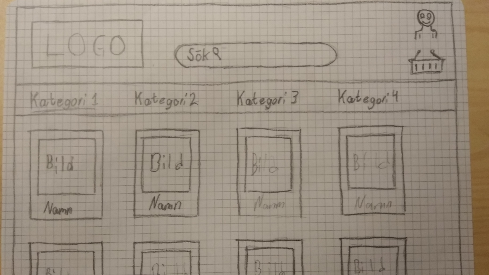
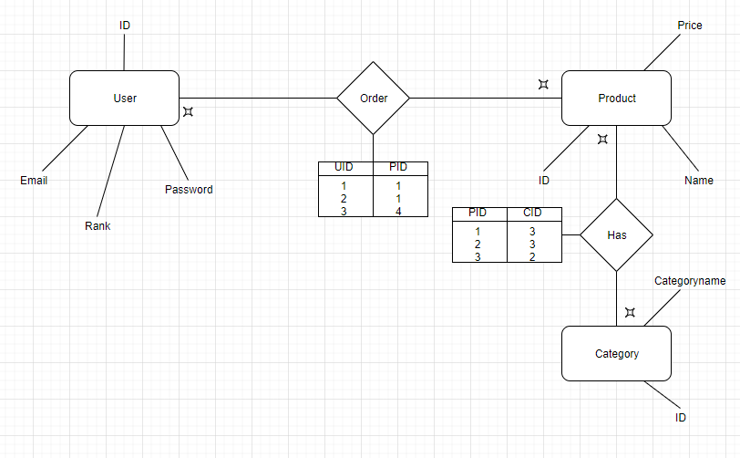

# Projektplan

## 1. Projektbeskrivning (Beskriv vad sidan ska kunna göra)
Hemsidan ska ha en inloggningsfuntion samt en regristreringsfuntion. När man sedan har loggat in ska man komma till "main pagen" där man ska kunna lägga till resor samt redigera dem och ta bort dem.
## 2. Vyer (visa bildskisser på dina sidor)
Bildskiss.jpg

## 3. Databas med ER-diagram (Bild)
Flowchart.png

I och med att jag ändrade vad min hemsida skule göra efter att jag gjorde min flowchart samt databas så ledde det till att jag har vissa tables och attribut har namn som inte riktigt passar in. Tex attributet "category_name" som i min hemsida nu är rese destinationen. Jag gjorde inte heller klart alla funktioner som hela hemsidan skulle ha använd i och med att jag inte hade tid vilket ledde till att jag inte använder alla tables och attribut.
## 4. Arkitektur (Beskriv filer och mappar - vad gör/inehåller de?)
db mappen innehåller min db browser databas där jag har information som tex email och lösenord

Public mappen innehåller img mappen vilket har de bilder jag använder för min sida. Bilderna är i public i och med att alla användare ska se dem.

Views mappen innehåller allt mitt "front end" dvs det som ska visas på hemsidan. Inne i mappen finns mina slim filer som innehåller det som visas på min main page och inlåggningsida.

app.rb är hjärnan av allt, det är där man bestämmer vad proggrammet gör och vad som händer när man går in på de andra delsidorna genom att definera routes.
